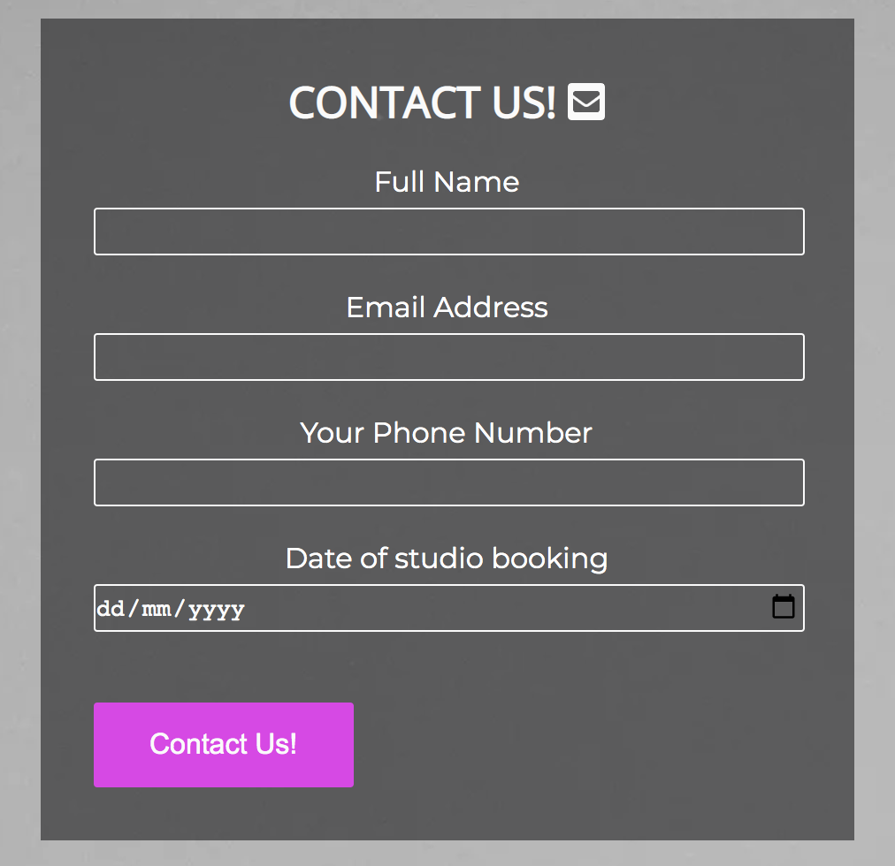

# Can't Stop Wont Stop Studios

Can’t stop won’t stop studios is a specialist musician website that aims to offer a recording, rehearsal, mixing and mastering studio for musicians of varying abilities and ranges based in Nottingham. With ever growing accessibility of music hardware and software, ‘bedroom producers’ have become ever present; whereby musicians record, perform and create music within the confines of their own house. Whilst becoming ever popular, ‘Bedroom producing’ has its limitations such as: equipment space, sound quality, lack of support, sound acoustics and a variety of other issues. Music studios are therefore still an important cog in the musicians’ wheel. Can’t stop won’t stop studios aims to provide a space where musicians can bring skeleton ideas to finish off to achieve a professional sound, or create brand new musical ideas from scratch. Throughout the website, the aim is to showcase the studio, the equipment, the abilities in the studio and give musicians and idea of what they can expect should they book a session. 

You can view the website here : https://nadsbuhdha.github.io/portfolio-project-1/index.html

## Aims 

The aim of the website is to give musicians from varying different backgrounds a quality rehearsal, recording, mixing and mastering space with a range of equipment as well as space for individual’s equipment to be used. The website, through the gallery, demonstrates the availability of said equipment. 

## Target auidence

The target audience for the website is musicians who need a studio to record or rehearse. The space is equipt so any genre of music can have access to equipment and space available. The accessibility of the studio allows beginner musicians to access the equipment and facilities with ease. In order to attract potential clients, equipment has been displayed alongside live music sessions to showcase the scope and range of what is achievable. 

## User expectations

As there is a specific target audience, musicians, for this website the following user expectations were considered when creating the site:

*	The site is simple clear and easy to use. 
*	The structure is logical and obvious.
*	The site is responsive and users can expect to see the same content on different devices without a reduction in quality. 
*	The media content included on the site is relevant and meaningful to the services provided
*	A contact form is utilised so users can easily contact the studio and enquire about booking dates. 

## Colour Schemes 

Dark UI was chosen for the colour scheme of the website. Generally, studios are low light environments and often synonymous with night-time and after-hours usage, therefore the darker colour tones were utilised to represent that. Darker tones are more relevant to the websites branding. Dark colours in the navigation and footer contrast well with the images displayed across the site. 

The navigation bar and the footer featured the colour: #19181a
The navigation and footer links across the site featured the colour: #D83fe7
A sleek purple which contrasted well with the dark navigation and footer, giving a professional look. 

## Fonts 

Open sans was used for the heading fonts. Open sans is recommended for its legibility, high readability, and friendly appearance. Sans-serif was utilised as a back-up font. 

Monserrat was chosen for the main body text. A clean and sophisticated font, it was recommended by google fonts to compliment Open Sans. San Serif was also used as a back-up font. 

## Wireframes 

Balsamiq was utilised to create wireframes of the website. Idea templates were mocked up in order to develop an idea of how elements of the websites would work across different platforms and how responsive elements may look resized.

### Mobile Home Page

### Mobile Gallery Page

### Mobile Contact Page

### Desktop Home Page

### Desktop Gallery Page

### Desktop Contact Page

## Features

### Navigation bar  

Each three pages of the site contain a navigation bar with links ‘Home’ ‘Gallery’ and ‘Contact’. Each of the links highlight when hovered over to indicate what the user is about to click on. The page which the user is on is underlined on the navigation bar. 

In the left-hand corner of the navigation bar, the websites logo is featured which users can also press to revert back to the 'Home’ page. The use of the navigation bar eliminates the need to use the back button to manoeuvre around the website. 

Landing page hero image – A large, midrange shot of the studio control room was used as the home pages hero image. This has been used in order to draw potential website users in and immediately give them an idea of the studio and what will be available to them. 
A text overlay with the words ‘recording, rehearsing, mixing & mastering’ was placed on top of the text to give a short and snappy overview of the overall usages of the studio.  

### About us section

The about us section contains two brief descriptions of who we are as well as an overview of the type of equipment and resources we have available. Each section is of equal size and features a h2 heading with a short paragraph underneath outlining important information about the studio. The h2 letter spacing is set at 0.2em so that the spacing draws the user in yet is still responsive to smaller devices. It is  explicitly stated that this studio is available for any ability musicians in order to ensure amateur musicians are enticed to use the studio whilst more advanced musicians are aware their needs will be catered for.  

### Footer
 

The bottom of each pages features a footer which has links to social media sites. These links open in a new browser page so users are not diverted away from the website. The hover element, featured in the header, is utilised in the footer to keep the congruence of the website.  

### Gallery

Images - The gallery page features a variety of photos of the studio, equipment recording and mixing spaces. The gallery is organised into ‘instagram’ styled boxes (using the 'display:grid') with a short caption about the resources featured in each picture. The gives the user a visual insight into what they can expect when booking a session within the studio. The image gallery is fully responsive with images resizing depending on the device size. 

Desktop view
 

 

Mobile view
 

 

Video – Underneath the images there is a clickable You-Tube link to a video of a live recording within the studio. This further imbeds the idea into the user of what is achievable with in the studio. 

### Contact us  

The contact us page features a form which allows users to enter their name, email & phone number. It also allows users to specify date which they would like to book the studio. The contact form includes a mandatory field where users must input their information in order to contact. 

The contact form shows that information has correctly been submitted.

A google map is included under the contact form so users can easily locate the studio. 

## Technologies used

* HTML5 – for structuring the website
* CSS3 –  for styling the website
* Balsamiq – for mock ups of the site
* Googlefonts – for site fonts 
* Tinypng – for compressing images and converting image files
* Font awesome – for site icons 
* W3C Markup and Jigsaw validation  - used to test and validate the HTML and CSS 
* Javascript - Used for the on click implimentation of the gallery images / text.

## Testing 

### Google developer tools 
Google chrome developer tools were consistantly utilised throughout the building of the website to rigorously test the responsivenes of the elements within the site. 
The inspect tool was ultised to manipulate and alter elements within the website for testing. Once element dimensions and alterations were successful, the CSS was copied into the CSS stylesheet and chages were permanently applied. 

### manuel testing

Manuel testing on devices was also undertaken, devices tested include:

* Iphone x
* Ipone 11
* Ipad 
* huawei p30

To ensure cross compatability, different browsers were tested these included :
* Safari
* Firefox
* Googlechrome 

## W3C Validator Tools

W3C Validator was used to check for error within my HTML code. 

The final check presented error free HTML 

### Index Page

### Gallery Page

### Contact Page

## CSS Validator 

The CSS passed through the validator without any issues. 

Inital preceeding bugs found in HTML & CSS are discussed in the BUGS section. 

## Lighthouse Testing

Lighthouse was utilised to test the performance, accessability, best practices and SEO of the website. 
Both desktop and mobile were tested. 

### Home Page Desktop

### Gallery Page Desktop

### Contact Page Desktop

### Home Page Mobile

### Gallery Page Mobile

### Contact Page Mobile

As evidenced, there is significant accessibility across the website on both mobile and desktop devices. The use of alt attributes and contrasting colours were utilised to achieve this. 
The website performance was moderately downgraded on mobile devices. This is due to the use of images in the gallery section. Whilst the images were optimised for size, they still had a minor impact on mobile site performance.

## Bugs

### solved bugs

* When I initally ran the HTML code through the validator, a stray div was highlighted. This was quickly resolved. 

* A HTML validator error occurred during testing due to the imbedded iframe. The frameborder="0" caused the error and once removed, the error was solved.

* When testing on the Ipad Pro, the home page did not have enough content to stretch its height to fit to the bottom of the page. This was solved with a media query which increased the height on the sections and divs once a minimum height was reached. 

* When tested on mobile devices, the hover effect utilised on the gallery was not operational. In order to solve this an 'on:click' javascript element was added which allows users to tap images on the gallery to reveal the information. 

* During testing, it was noticed that the gallery page nav bar would break due to the size of the image gallery. A max-width of 900px was used in order to solve this bug. 

## Deployment

The site was deployed to GitHub pages. The following steps were used to deploy :

* In the GitHub repository, navigate to the Settings tab
* Select the Pages sub-menu
* From the source section drop-down menu, select the Master Branch, and then hit save
* Once the master branch has been selected, the page provided a link to the live website. 

A live link to the website can be found here - [Can't Stop Won't Stop Studios](https://nadsbuhdha.github.io/portfolio-project-1/)

## Credits 

### Content 

* Images throughtout the website came from: https://unsplash.com/ and https://www.pexels.com/
* The hero image was inspired by the 'Love Running' code institute project.
* The form on the 'contact us' page was influnced and adapted by the 'Love Running' code institute project.
* To create the image gallery, a youtube tutorial was utilised: https://www.youtube.com/watch?v=tSyYU0I9gYU&t=115s
* The icons in the footer and contact page came from https://fontawesome.com/
